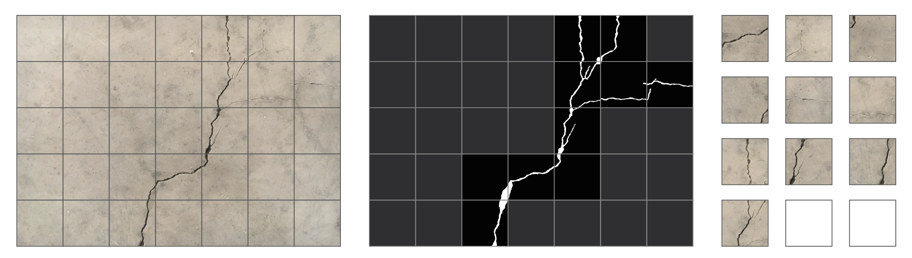
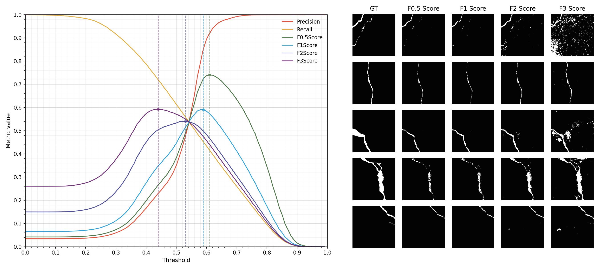

# Concrete Crack Segmentation
Semantic segmentation of cracks in concrete using U-Net based Fully Convolutional Network.

## Dataset
Original dataset is 458 high-resolution (4032x3024) concrete crack images obtained from [here](https://data.mendeley.com/datasets/jwsn7tfbrp/1). Dataset used for this project was generated as follows:
1. Image is scaled down and split up into a 224x224 grid.
2. Segmentation mask is used to select patches on the grid that contain target class (i.e. crack is present)

> Figure 1: Left to right, grid over original image; selection of patches with target class; generated data.

To augment the dataset at pre-processing stage, image resolution is downscaled by multiple factors (1/6, 1/4, 1/3), thereby allowing to generate images of cracks of various scales. Additionally, patches are generated with a 112px overlap, thereby allowing fully capture all of the cracks in each image and increase dataset size by 4x.

Original dataset is divided into train, validation and test sets at 0.6:0.2:0.2 split and pre-processed with the above routine. This results in 18132, 6244 and 6260 images in each set correspondingly.

## Approach

### Metric
For segmentation of cracks in concrete it makes sense to prioritize recall over precision. Thus, a typical F1 score can be revised to Fbeta score where beta factor defines the degree of importance of recall and precision in the metric. For this problem F2 score is selected as the most appropriate:

$$
F_{\beta} = (1 + \beta^2) \cdot \frac{\mathrm{precision} \cdot \mathrm{recall}}{(\beta^2 \cdot \mathrm{precision}) + \mathrm{recall}}, \quad \mathrm{where} \\ \beta=2
$$

### Baseline Model
As a baseline for crack segmentation a threshold model is set up. Each RGB photo of concrete is converted to black & white and is further normalized to a [0,1] scale. This allows to then use a threshold for a binary classifier that can be optimized to maximize the chosen metric on the validation set. This process is shown below as well as a comparison of what maximizing different Fbeta metrics means visually.

### U-Net Architecture

### Loss Functions

### Results

## References

Özgenel, Çağlar Fırat (2019), 
“Concrete Crack Segmentation Dataset”, 
Mendeley Data, V1, doi: 10.17632/jwsn7tfbrp.1

